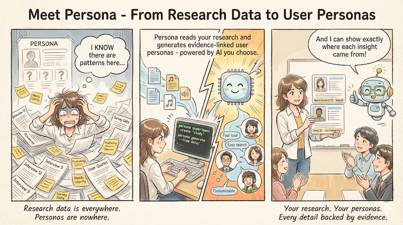

[](https://www.python.org/downloads/)
[]()
[](https://claude.ai/code)


> [!NOTE]
> Persona is under active development. If you need a working solution today, consider [Taguette](https://www.taguette.org/) for qualitative analysis or [Persona Hub](https://github.com/tencent-ailab/persona-hub) for synthetic personas.

## Generate realistic user personas from your data using AI



*[Generated](docs/assets/prompts/getting-started-comic.md) by Gemini 3.*

`Persona` is an AI-powered tool that generates realistic user personas from quantitative and qualitative research data. It supports multiple LLM providers *(incl. OpenAI, Anthropic, Gemini)* and provides an experiment-centric workflow for reproducible persona generation.

### Who is this for?

- **Academic Researchers** experimenting with persona generation at scale
- **UX Researchers** synthesising interview and survey data
- **Design Teams** creating data-driven personas
- **Product Managers** understanding user segments

## Quick Start

### Prerequisites

- Python 3.12 or higher
- API key from OpenAI, Anthropic, or Google

### Installation

```bash
# Create virtual environment
python3.12 -m venv .venv
source .venv/bin/activate

# Install from source (development)
git clone https://github.com/REPPL/Persona.git
cd Persona
pip install -e ".[all]"
```

### Your First Persona

```bash
# 1. Verify your setup
persona check

# 2. Create an experiment
persona experiment create "my-research" -d "My Research Study"

# 3. Add your data files to experiments/my-research/data/

# 4. Generate personas
persona generate --from experiments/my-research/data/ --experiment my-research
```

Your personas are saved as JSON and Markdown in timestamped output folders.

## Features

| Feature | Benefit |
|---------|---------|
| **Evidence-linked personas** | Every attribute traced to your source data |
| **Cost transparency** | Know exactly what you'll pay before generating |
| **Multiple AI providers** | Choose OpenAI, Claude, or Gemini based on your needs |
| **Reproducible experiments** | Re-run any generation with identical results |
| **Works with your data** | CSV, JSON, Markdown, and more - no reformatting needed |
| **Beautiful output** | Polished terminal UI and ready-to-share exports |

## Example Output

```json
{
  "name": "Research Rachel",
  "age": 34,
  "occupation": "UX Research Lead",
  "goals": [
    "Synthesise research faster without losing nuance",
    "Create personas that stakeholders actually use"
  ],
  "pain_points": [
    "Manual analysis takes weeks",
    "Difficulty tracking evidence back to source data"
  ],
  "evidence": {
    "goals[0]": "Interview 3, line 45: 'I spend more time writing reports than doing research'",
    "pain_points[1]": "Survey response 12: 'I can never remember which interview a quote came from'"
  }
}
```

## Documentation

| I want to... | Go to... |
|--------------|----------|
| Learn step-by-step | [Tutorials](docs/tutorials/) |
| Accomplish a specific task | [How-to Guides](docs/guides/) |
| Understand concepts | [Explanation](docs/explanation/) |
| Look up specifications | [Reference](docs/reference/) |

### Key Documents

- [Getting Started Tutorial](docs/tutorials/01-getting-started.md)
- [Use Cases](docs/use-cases/) - What you can do with Persona
- [System Design](docs/development/planning/architecture/system-design.md)
- [Roadmap](docs/development/roadmap/)

## Configuration

### Environment Variables

```bash
# Set your preferred provider's API key
export OPENAI_API_KEY="sk-..."
# or
export ANTHROPIC_API_KEY="sk-ant-..."
# or
export GOOGLE_API_KEY="..."
```

### Experiment Configuration

```yaml
# config.yaml
vendor: openai
model: gpt-4o
persona_count: 5
```

See [Configuration Reference](docs/reference/) for all options.

## Development

```bash
# Install with development dependencies
pip install -e ".[all]"

# Run tests
pytest tests/

# Run linting
ruff check src/

# Run type checking
mypy src/
```

See [Development Documentation](docs/development/) for contributing guidelines.

## Comparison with Similar Tools

| Tool | Approach | Persona's Advantage |
|------|----------|---------------------|
| Manual synthesis | Time-consuming, subjective | Faster, consistent, evidence-linked |
| Generic LLM prompting | No structure, hallucination risk | Structured output, source validation |
| [Taguette](https://www.taguette.org/) | Qualitative data analysis (tagging) | Automated persona generation |
| [QualCoder](https://github.com/ccbogel/QualCoder) | Desktop QDA application | CLI-first, multi-provider AI |
| [Persona Hub](https://github.com/tencent-ailab/persona-hub) | Pre-built synthetic personas | Generated from YOUR data |
| [AI Persona Lab](https://github.com/marc-shade/ai-persona-lab) | AI chat personas with Ollama | Evidence-linked research personas |
| [PersonaCraft](https://www.sciencedirect.com/science/article/abs/pii/S1071581925000023) | Academic methodology | Open source, CLI-first |

## Lineage

Persona is a clean rewrite of [PersonaZero](https://github.com/REPPL/PersonaZero), applying lessons learned during the development of [ragd](https://github.com/REPPL/ragd).

## AI Transparency

This project is developed with AI assistance. See the [AI Contributions Statement](docs/development/ai-contributions.md).
